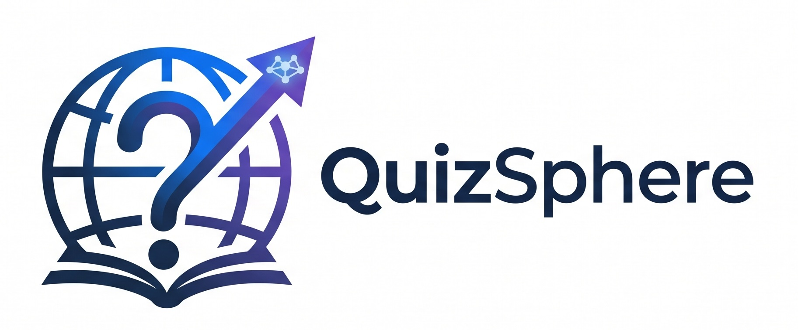

<br />
<p align="center">
  
  <h1 align="center">QuizSphere</h1>
  <h3 align="center">AI-Powered Adaptive Learning Platform</h3>

  <p align="center">
    Turn any topic (or PDF) into an intelligent quiz, practice adaptively, and
    track your learning with analytics, gamification and certificates.
  </p>
</p>

<div align="center">


</div>

---

## Overview

QuizSphere is a full-stack, AI-powered adaptive learning platform:

- **AI Quiz Generation** — describe a topic (or upload a PDF) and the AI builds
  a balanced, curriculum-aligned quiz for you.
- **Adaptive Learning** — questions adjust to your skill level, sharpening your
  weak areas through concept mastery and targeted practice.
- **AI Learning Coach** — step-by-step explanations and personalized hints when
  you get stuck.
- **Performance Analytics** — strengths, weak areas and progress visible in
  clear reports.
- **Gamification** — XP, levels, daily streaks, achievements and a global
  leaderboard.
- **Certificates** — earn shareable certificates (with QR verification) when
  you master a topic.

---

## Architecture

```
┌────────────────────────────┐         ┌─────────────────────────────┐
│  PHP frontend (port 8000)  │  HTTP   │  FastAPI backend (8001)     │
│  server-rendered pages     ├────────►│  auth, quiz, analytics,     │
│  includes/ · pages/ · api/ │  ────►  │  gamification, certificates │
└────────────────────────────┘         └──────────────┬──────────────┘
                                                      │
                                        ┌─────────────▼─────────────┐
                                        │   Supabase               │
                                        │  Auth · Postgres · RLS    │
                                        │  Storage (PDFs)          │
                                        │  Realtime                │
                                        └───────────────────────────┘
```

- **Frontend**: PHP 8.5 server-rendered pages + vanilla JS (`assets/js/app.js`).
- **Backend**: FastAPI (Python) under `backend/` — added alongside the PHP API
  as a strangler migration; all traffic now routes to FastAPI.
- **Data**: Supabase (GoTrue auth, Postgres with RLS, private storage bucket).
- **AI**: Gemini (primary) with Groq fallback, rate-limited and prompt-validated.

---

## Getting Started

### Prerequisites

- PHP 8.5+ (with `curl`, `openssl`, `mbstring`, `fileinfo`)
- Python 3.14+
- A Supabase project (Auth, Postgres, Storage)

### 1. Configure secrets

Secrets are git-ignored; never commit them.

- PHP: copy `config/env.example.php` → `config/env.php` and fill in
  `SUPABASE_URL`, `SUPABASE_ANON_KEY`, AI keys, etc.
- Backend: copy `backend/.env.example` → `backend/.env` and fill in the same
  values plus a `SUPABASE_SECRET_KEY` / session secret.

### 2. Set up the backend

```bash
cd backend
python -m venv .venv
.venv\Scripts\activate        # Windows
pip install -r requirements.txt
uvicorn app.main:app --host 127.0.0.1 --port 8001
```

Verify: `curl http://127.0.0.1:8001/api/health` → `{"status":"ok"}`

### 3. Run the frontend

```bat
start-server.bat
```

Then open <http://localhost:8000>.

---

## Database

Apply schema in order against your Supabase project:

```
database/schema.sql              # base schema + RLS policies
database/migrations/phase3.sql   # AI generation support
database/migrations/phase4.sql   # concept mastery / adaptive practice
database/migrations/phase5.sql   # PDF study materials / coach
database/migrations/phase6.sql   # gamification, leaderboards, certificates
```

---

## Project structure

```
QuizSphere/
├── api/                # PHP API endpoints (fallback; session bridge is live)
├── assets/             # CSS, JS, images
├── backend/            # FastAPI backend (Python)
│   └── app/            #   api, services, repositories, schemas, utils
├── config/             # app config + env.php (git-ignored secrets)
├── database/           # schema.sql + per-phase migrations
├── includes/           # PHP shared fragments & services (bootstrap.php)
│   └── AI/             #   Gemini/Groq providers, prompt builder, coach
├── pages/              # authenticated UI pages (dashboard, quiz, …)
├── storage/            # runtime rate-limiter state
├── index.php           # landing page
├── login.php           # sign-in
├── register.php        # sign-up
└── verify-certificate.php  # public certificate verification
```

---

## Security

- Secrets live only in git-ignored `config/env.php` / `backend/.env`.
- Auth uses Supabase GoTrue; tokens are kept in server-side PHP sessions and
  never stored in `localStorage`/cookies.
- CSRF protection for state-changing requests; XSS-safe output escaping.
- AI generation is rate-limited per user/IP.
- Postgres RLS restricts data access; certificate verification is public-safe.

---

## Testing

```bash
cd backend
python -m pytest            # unit + live API tests
```

---

## License

MIT