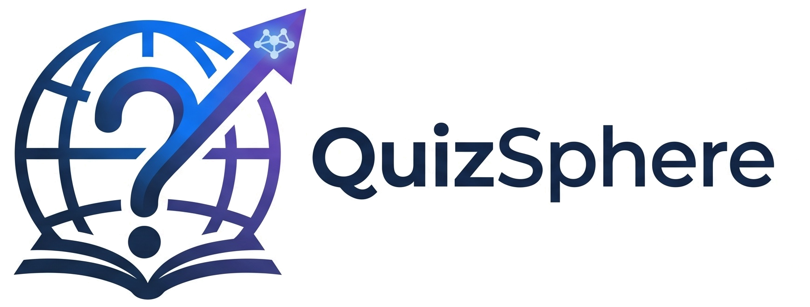

<br />
<p align="center">
  
  <h1 align="center">QuizSphere</h1>
  <h3 align="center">AI-Powered Adaptive Learning & Assessment Platform</h3>

  <p align="center">
    Transform any topic or PDF study material into intelligent, curriculum-aligned quizzes. Practice adaptively with real-time AI coaching, in-depth performance analytics, gamified achievements, and verifiable certificates.
  </p>
</p>

<div align="center">


</div>

---

## Table of Contents

- [Overview](#overview)
- [Key Features](#key-features)
- [Architecture](#architecture)
- [AI Engine (3-Tier Cascade)](#ai-engine-3-tier-cascade)
- [AI Learning Coach](#ai-learning-coach)
- [Canva-Style Professional Certificates](#canva-style-professional-certificates)
- [Prerequisites](#prerequisites)
- [Quick Start Guide](#quick-start-guide)
  - [1. Configuration & API Keys Setup](#1-configuration--api-keys-setup)
  - [2. Database Setup](#2-database-setup)
  - [3. Start the Backend (FastAPI)](#3-start-the-backend-fastapi)
  - [4. Start the Frontend (PHP)](#4-start-the-frontend-php)
- [Project Structure](#project-structure)
- [API & Endpoints](#api--endpoints)
- [Security & Resilience](#security--resilience)
- [Testing](#testing)
- [License](#license)

---

## Overview

**QuizSphere** is an enterprise-grade EdTech platform designed for continuous learning, assessment generation, and knowledge retention. It combines server-rendered PHP speed with asynchronous FastAPI Python microservices and Supabase cloud infrastructure.

Whether learning independently or preparing for formal examinations, QuizSphere provides instant automated curriculum generation, identifies knowledge gaps, and dynamically adapts question difficulty to accelerate mastery.

---

## Key Features

- **3-Tier AI Quiz Generation**: Fault-tolerant AI cascade running **OpenAI** (`gpt-4o-mini`) as primary, **Google Gemini** (`gemini-2.5-flash`) as first fallback, and **Groq** (`openai/gpt-oss-20b`) as second fallback.
- **High-Performance AI Coach**: Real-time personalized Socratic tutor powered by optimized Google Gemini, providing instant conceptual hints and explanations without spoiling answers.
- **PDF Study Material to Quiz**: Securely upload lecture slides or textbooks (up to 10 MB) to generate syllabus-grounded quizzes using server-side document extraction and noise cleaning.
- **Adaptive Learning Engine**: Tracks concept-by-concept mastery, adjusting future question selection to target weaknesses until topics are mastered.
- **Canva-Style Achievement Certificates**: Professionally styled certificates of achievement with geometric Guilloché borders, official QuizSphere branding, unique verification UUIDs, and live QR verification.
- **Dual-Mode PDF Export**: High-fidelity, client-side PDF export with print CSS and native `Ctrl+P` fallback.
- **Visual Performance Analytics**: Comprehensive student dashboard with Chart.js visualizations, concept mastery percentages, accuracy trends, and study history.
- **Gamification & Engagement**: Earn XP, level up, maintain daily study streaks, unlock achievement badges, and compete on the global leaderboard.
- **Intuitive App Navigation**: Seamless dashboard routing with persistent session awareness—clicking the QuizSphere logo always navigates to your active learning dashboard.

---

## Architecture

```
┌─────────────────────────────────┐           ┌──────────────────────────────────┐
│   PHP Frontend (Port 8000)      │   HTTP    │   FastAPI Backend (Port 8081)    │
│  • Server-rendered pages        ├──────────►│  • Async Python 3.12+ microservice│
│  • Session & Auth bridge        │   Proxy   │  • Auth, analytics & certificates │
│  • includes/ · pages/ · api/    │           │  • Rate limiting & security headers│
└───────────────┬─────────────────┘           └─────────────────┬────────────────┘
                │                                               │
                │                 PostgREST & Storage           │
                └───────────────────────┬───────────────────────┘
                                        ▼
                      ┌───────────────────────────────────┐
                      │             Supabase              │
                      │  • Postgres with Row Level Security│
                      │  • GoTrue Authentication          │
                      │  • Private PDF Storage Bucket     │
                      └───────────────────────────────────┘
```

---

## AI Engine (3-Tier Cascade)

QuizSphere implements a high-availability AI orchestrator with configurable priority ordering, automatic silent skipping of unconfigured providers, and single-stage output validation:

```
                            QuizRequest
                                 │
                                 ▼
                             AiService
                                 │
                 ┌───────────────┼───────────────┐
                 ▼               ▼               ▼
            1. OpenAI       2. Gemini        3. Groq
            (PRIMARY)      (FALLBACK 1)    (FALLBACK 2)
           gpt-4o-mini    gemini-2.5-flash  gpt-oss-20b
                 │               │               │
                 └───────────────┼───────────────┘
                                 ▼
                        AiResponseValidator
                     (Single-stage validation)
                                 │
                                 ▼
                           QuizRepository
```

### Cascade Highlights
- **Deterministic Priority**: Tries OpenAI first. If unavailable (rate-limited, quota exceeded, network timeout, 5xx), gracefully fails over to Gemini, then Groq.
- **Envelope Unwrapping**: Resilient parser supporting top-level JSON arrays, object envelopes (e.g. `{"questions": [...]}`), and Markdown-fenced blocks.
- **Single-Stage Validation**: Enforces exact question count, 4 distinct answer choices, valid 0-3 index, and clean educational text without duplicate checks.
- **Safe Diagnostics**: Tracks per-provider execution duration (`duration_ms`) and attempted provider history while strictly masking API keys in logs.

---

## AI Learning Coach

The **AI Coach** (`pages/coach.php` & `api/coach.php`) is an interactive tutor designed to reinforce learning:

- **Gemini Engine**: Dedicated to Google Gemini for rapid, high-quality pedagogical conversational turns.
- **Optimized Context Window**: Truncates historical dialogue to the 6 most relevant turns and focuses solely on the user's active concept mastery profile—eliminating multi-second lag from bloated payloads.
- **Socratic Pedagogy**: Trained to explain core principles, guide problem-solving steps, and offer targeted hints without giving away quiz solutions directly.
- **Real-Time Client Experience**: Markdown-rendered responses, syntax highlighting, and instant query suggestions.

---

## Canva-Style Professional Certificates

QuizSphere features a Canva-inspired **Certificate of Achievement** design (`pages/view-certificate.php`):

- **Premium Visual Layout**: Double-lined geometric frame with decorative corner flourishes, balanced typography, and clean contrast.
- **Official Brand Seal**: Features the official QuizSphere brand emblem and institutional badge.
- **Verifiable Credential**: Every certificate displays an official verification token (UUID) and dynamic QR code linking to `/verify-certificate.php?id=<uuid>`.
- **Export & Print Ready**:
  - Export PDF directly via `html2pdf.js` with calibrated A4 landscape proportions.
  - One-click native print fallback (`window.print` / `Ctrl+P`) with dedicated `@media print` stylesheets to ensure high-resolution paper output.

---

## Prerequisites

- **PHP 8.5+** with extensions enabled: `curl`, `openssl`, `mbstring`, `fileinfo`.
- **Python 3.12+** (recommended Python 3.14).
- **Supabase Account**: A project with Postgres database, GoTrue auth, and a private `study-materials` storage bucket.
- **AI API Keys**:
  - [OpenAI API Key](https://platform.openai.com/) (Required for primary quiz generation)
  - [Google Gemini API Key](https://aistudio.google.com/) (Required for AI Coach & quiz generation fallback)
  - [Groq API Key](https://console.groq.com/) (Required for fast secondary quiz generation fallback)

---

## Quick Start Guide

### 1. Configuration & API Keys Setup

Secrets live only in git-ignored configuration files. Never commit them to version control.

#### A. Configure PHP Frontend (`config/env.php`)
Copy the template configuration file:

```bash
cp config/env.example.php config/env.php
```

Edit `config/env.php` and fill in your Supabase credentials and AI keys:

```php
// Supabase credentials
define('SUPABASE_URL', 'https://your-project.supabase.co');
define('SUPABASE_ANON_KEY', 'your-anon-key');
define('SUPABASE_SERVICE_ROLE_KEY', 'your-service-role-key');

// AI Provider Priority (openai -> gemini -> groq)
define('AI_PRIMARY_PROVIDER', 'openai');
define('AI_FALLBACK_PROVIDER', 'gemini');
define('AI_SECOND_FALLBACK', 'groq');

// 1. OpenAI (Primary Quiz Generator)
define('OPENAI_API_KEY', 'sk-proj-...');
define('OPENAI_MODEL', 'gpt-4o-mini');
define('OPENAI_TIMEOUT', 30.0);

// 2. Google Gemini (AI Coach & First Fallback)
define('GEMINI_API_KEY', 'AIzaSy...');
define('GEMINI_MODEL', 'gemini-2.5-flash');
define('GEMINI_TIMEOUT', 30.0);

// 3. Groq (Second Fallback)
define('GROQ_API_KEY', 'gsk_...');
define('GROQ_MODEL', 'openai/gpt-oss-20b');
define('GROQ_TIMEOUT', 30.0);

// FastAPI backend URL
define('API_URL', 'http://localhost:8081');
```

#### B. Configure FastAPI Backend (`backend/.env`)
Edit `backend/.env` with your Supabase and AI keys:

```ini
SUPABASE_URL=https://your-project.supabase.co
SUPABASE_KEY=your-anon-key
SUPABASE_SERVICE_ROLE_KEY=your-service-role-key

OPENAI_API_KEY=sk-proj-...
GEMINI_API_KEY=AIzaSy...
GROQ_API_KEY=gsk_...
```

---

### 2. Database Setup

Execute the SQL schemas and migrations in order inside your Supabase SQL Editor:

```sql
database/schema.sql              -- Base schema, tables & Row Level Security (RLS)
database/migrations/phase3.sql   -- AI generation tables & indices
database/migrations/phase4.sql   -- Concept mastery & adaptive practice tracking
database/migrations/phase5.sql   -- PDF study material metadata & coach history
database/migrations/phase6.sql   -- Gamification (XP, badges, streaks, certificates)
```

Ensure a storage bucket named `study-materials` is created with private access in Supabase Storage.

---

### 3. Start the Backend (FastAPI)

Open a terminal to start the FastAPI Python server:

```bash
cd backend
python -m venv .venv

# Windows:
.venv\Scripts\activate

# Linux / macOS:
source .venv/bin/activate

pip install -r requirements.txt
uvicorn app.main:app --host 127.0.0.1 --port 8081
```

Verify backend health:
```bash
curl http://127.0.0.1:8081/api/health
# Response: {"status":"ok"}
```
Interactive API documentation is available at <http://127.0.0.1:8081/api/docs>.

---

### 4. Start the Frontend (PHP)

Open a new terminal in the project root:

```bat
start-server.bat
```
*(Or specify a custom port: `start-server.bat 8000`)*

Open your browser and navigate to:
**<http://localhost:8000>**

---

## Project Structure

```
QuizSphere/
├── api/                       # PHP API endpoints
│   ├── generate_quiz.php      # Topic-based AI quiz creation endpoint
│   ├── pdf_quiz.php           # Multipart PDF parsing & AI quiz creation
│   ├── coach.php              # Optimized AI Learning Coach chat endpoint
│   ├── submit_attempt.php     # Quiz submission, scoring & XP reward endpoint
│   └── helpers.php            # Shared API response helpers, auth gates & CSRF
├── assets/                    # Static assets
│   ├── css/style.css          # Design system, Canva certificate & layout styles
│   ├── js/app.js              # Vanilla ES2022 interactive client logic & PDF export
│   └── images/                # Official QuizSphere logos and icons
├── backend/                   # FastAPI microservice (Python)
│   ├── app/
│   │   ├── api/routes/        # Endpoints (auth, health, quiz, certificates)
│   │   ├── core/              # Settings, secret-redacting logger, error handlers
│   │   ├── services/          # Business logic (AI service, learning coach, analytics)
│   │   └── utils/             # Async Supabase & rate limiter helpers
│   ├── requirements.txt       # Python dependencies
│   └── .env                   # Python environment secrets (git-ignored)
├── config/                    # Centralized application configuration
│   ├── config.php             # Core constants, AI defaults & session bootstrap
│   ├── env.php                # Local environment secrets (git-ignored)
│   └── env.example.php        # Template environment file
├── database/                  # SQL schema and incremental migrations
├── includes/                  # Reusable PHP components & services
│   ├── AI/                    # AI Provider Suite
│   │   ├── AiProviderInterface.php  # Provider contract
│   │   ├── OpenAIProvider.php       # Primary OpenAI provider (gpt-4o-mini)
│   │   ├── GeminiProvider.php       # Fallback 1 Gemini provider (gemini-2.5-flash)
│   │   ├── GroqProvider.php         # Fallback 2 Groq provider (gpt-oss-20b)
│   │   ├── AiService.php            # Provider cascade orchestrator
│   │   ├── AiPromptBuilder.php      # Educational prompt generation
│   │   ├── AiResponseValidator.php  # Schema & quality validator
│   │   ├── AiHttp.php               # Shared IPv4-safe cURL HTTP client
│   │   └── LearningCoach.php        # AI tutoring assistant service
│   ├── bootstrap.php          # Centralized dependency loader
│   ├── SupabaseClient.php     # PostgREST and Storage HTTP client
│   ├── QuizGenerator.php      # Generation & persistence orchestrator
│   ├── CertificateService.php # Certificate generation & validation
│   ├── sidebar.php            # Authenticated application sidebar & mobile drawer
│   ├── navbar.php             # Public site navigation header
│   └── footer.php             # Site footer fragment
├── pages/                     # Authenticated dashboard views
│   ├── dashboard.php          # Main learning hub & analytics overview
│   ├── generate.php           # AI quiz creator interface
│   ├── upload.php             # PDF document upload & extractor UI
│   ├── quiz.php               # Interactive assessment taking screen
│   ├── results.php            # Detailed score analysis & review
│   ├── coach.php              # Real-time AI Learning Coach interface
│   ├── leaderboard.php        # Global rankings & XP standings
│   ├── certificates.php       # Earned certificates vault
│   ├── view-certificate.php   # Canva-style certificate viewer & PDF export
│   └── my_quizzes.php         # Saved quiz library
├── index.php                  # Public landing page
├── login.php                  # User authentication / sign-in
├── register.php               # User registration / sign-up
├── verify-certificate.php     # Public certificate verification page
├── php.ini                    # Bundled PHP configuration with required extensions
└── start-server.bat           # Local server launcher
```

---

## API & Endpoints

| Endpoint | Method | Auth | Description |
|---|---|---|---|
| `/api/health` | `GET` | No | FastAPI health check & service status |
| `/api/generate_quiz.php` | `POST` | Yes | Generates and saves a quiz from a topic |
| `/api/pdf_quiz.php` | `POST` | Yes | Extracts PDF text, generates quiz, and saves to library |
| `/api/coach.php` | `POST` | Yes | Submits user questions to the AI Learning Coach |
| `/api/submit_attempt.php` | `POST` | Yes | Submits quiz answers, updates XP, streaks, and mastery |
| `/pages/view-certificate.php?id=<uuid>` | `GET` | Yes | Renders the Canva-style certificate with PDF export |
| `/verify-certificate.php?id=<uuid>` | `GET` | No | Public verification of authentic completion certificates |

---

## Security & Resilience

- **Zero Client-Side Secrets**: All API keys (Supabase Service Role, OpenAI, Gemini, Groq) live strictly server-side.
- **Row Level Security (RLS)**: Enforced across all Supabase Postgres tables ensuring users only access their own quizzes and progress.
- **CSRF & Rate Limiting**: Anti-CSRF token verification on all POST actions; sliding-window rate limiting per IP and user ID.
- **Sanitized Logging**: All application logging automatically masks API keys, authorization tokens, and personal credentials.
- **Input Cleaning**: Uploaded PDF text is sanitized to filter out corrupted binary sequences, layout headers, and metadata noise prior to prompting AI models.

---

## Testing

### PHP AI Engine, Navigation & Test Suite
Run the test suite using the bundled `php.ini`:

```bash
# Test AI 3-tier cascade failover
php -c php.ini scratch/test_ai_cascade.php

# Test AI response parser & envelope unwrapping
php -c php.ini scratch/test_parser.php

# Test sidebar dashboard logo routing
php -c php.ini scratch/test_sidebar_navigation.php
```

### FastAPI Python Backend Tests
Run pytest from the `backend/` directory:

```bash
cd backend
python -m pytest tests/
```

---

## License

This project is open source and available under the [MIT License](LICENSE).